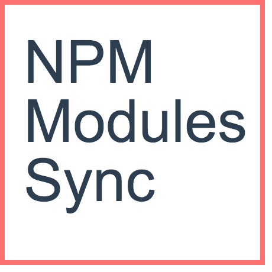

  

[](https://coveralls.io/github/riyadhalnur/npm-modules-sync?branch=master) [](https://travis-ci.org/riyadhalnur/npm-modules-sync) [](https://ci.appveyor.com/project/riyadhalnur/npm-modules-sync) [](https://dependencyci.com/github/riyadhalnur/npm-modules-sync) [](https://snyk.io/test/github/riyadhalnur/npm-modules-sync) [](https://raw.githubusercontent.com/riyadhalnur/npm-modules-sync/master/LICENSE) [](https://badge.fury.io/js/npm-modules-sync)  

[](https://nodei.co/npm/npm-modules-sync/)  

NPM Modules Sync
=================  
> Keep your global NPM packages in sync between machines.  

**TL;DR** While NVM and the likes let you keep packages in sync between multiple versions, 
if you develop across multiple machines, you can use this module to keep your global NPM packages in sync.  

### Installation  
`npm install -g npm-modules-sync`  

If you are using [Yarn](https://yarnpkg.com/):  
`yarn global add npm-modules-sync`  

### Getting started  
1. On the machine you want to use as the source of your package list, run  
`npm-sync init -t <your-github-token>`  
2. Note the ID of the gist returned from the previous step once it completes  
3. On the machine you want to sync using the the gist, run  
`npm-sync init -t <your-github-token> -i <gist-id>`  
4. Run `npm-sync up` subsequently on your main machine to update the list of packages  
5. Run `npm-sync dl` subsequently on your syned machines to download the current list of global packages  

**N.B** Step 1 needs to be run only once on the machine that you want to use as your source of truth. Similarly, step 3 needs to be run only once on every machine you want to keep in sync.  

### Usage  
```shell
  Usage
    $ npm-sync <input> [options]

  Options
    -t, --token Your GitHub token.
    -i, --id ID of Gist that is used by this module.
    -h, --help Show this help message.
    -v, --version Show version information.

  Examples
    $ npm-sync init -t 123e4567f89
    $ npm-sync i -t 123e4567f89
    $ npm-sync init -t 123e4567f89 -i 123456789
    $ npm-sync download
    $ npm-sync dl
    $ npm-sync upload
    $ npm-sync up
```  

### Contributing  
Read the [CONTRIBUTING](CONTRIBUTING.md) guide for information.  

### License  
Licensed under MIT. See [LICENSE](LICENSE) for more information.  

### Issues  
Report a bug in [issues](https://github.com/riyadhalnur/npm-modules-sync/issues).   

Made with love by [Riyadh Al Nur](https://verticalaxisbd.com)  
